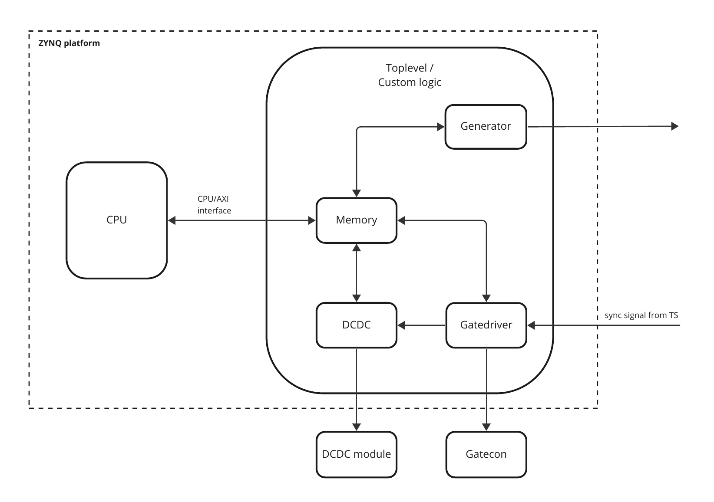
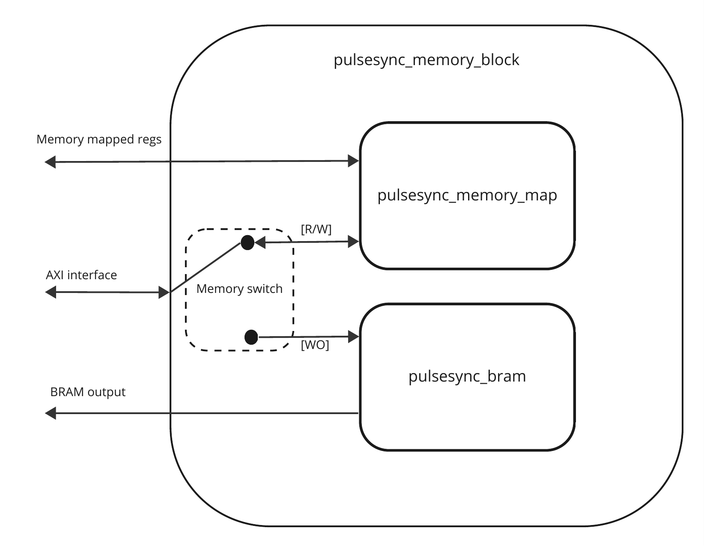

=================
Block description
=================

Block overview
--------------

The pulse sync implementation of the TX is based on a ZYNQ-7 platform, utilizing an integrated CPU and a programmable logic that implements all the custom logic required within the TX pulsesync implementation. The custom logic is divided into four blocks, which are instantiated in the hierarchical toplevel module:

- Memory
- DCDC
- Gatedriver
- Generator

The memory block allows for interfacing with the CPU and allows for user space programs running on the CPU to control and read status from each of the peripherals implemented within the logic.

The DCDC block implements the interface towards the DCDC hardware module. The block implements two PWM modules, for controlling the current and voltage on the DCDC hardware module, and 

The gatedriver is responsible for locking into the receiving sync signal from the TS and driver the gate transistors delivering energy onto the loop, in a given required pattern.

The generator block is used for testing purpose while developing the pulsesync application, it can mimic the sync pulses from the TS application thus it allows for running a complete TX system without the need to a TS.

  
   Block overview

The system interface from the logic towards external components is defined from the table below. The physical pin mapping described here, matches the physical interface on the currently used demo board. For now the ``Gatedrive_dbg`` signals are a mirrored logical signals of the ``Sync_A``, ``Sync_B`` and ``Sync_K``, plus a spare and are added just for easy measuring purpose during development, since the open drain signals requires pull-up resistors. Gate driver signals are inverted, so logical '0' is active and HiZ is inactive.

======== ================ ===== ============
Pin      Definition       I/O   Mode
======== ================ ===== ============
J11-17   Sync_A           O     Open drain
J11-18   Sync_B           O     Open drain
J11-19   Sync_K           O     Open drain
J11-24   PWM_I            O     Push/Pull
J11-26   PWM_V            O     Push/Pull
J11-28   DCDC_enable      O     Push/Pull
J13-5    Gatedrive_dbg[0] O     Push/Pull
J13-6    Gatedrive_dbg[1] O     Push/Pull
J13-7    Gatedrive_dbg[2] O     Push/Pull
J13-8    Gatedrive_dbg[3] O     Push/Pull
J13-13   Sync_gen         O     Push/Pull
J13-15   Sync_gen_n       O     Push/Pull
J13-39   Sync_in          I     TTL
======== ================ ===== ============

Topmodule
---------

The top-level module binds all the different modules together at the top level and also defines the interface with the external hardware attached to the FPGA module, according to the I/Os defined within table above. External hardware also includes external memory interface used by the CPU, but are predefined constructs when instantiating a ZYNQ module and is outside the scope of explanation for this documentation.
 
DC-DC block
-----------

The DC-DC block implements the control of the voltage and current pwm signals and enable signal for the physical DC-DC module. It defines the startup behavior of the PWM signals from default idle setting to required set-point regulation.
The DC-DC block controls two PWM generators for the physical DC-DC module, a set-point for current and a set-point for voltage. The PWM set-points are controllable by the user by loading PWM values into a register, and then starting the PWM generators. The user loadable PWM values are divided into a value-pair, an idle value and a run value. The idle value is a minimum setting for the DC-DC module, that is used when no power is transferred onto the loop. When the power is transferred onto the loop, the run mode setting of the PWM values will be used for each PWM module.

.. figure:: ./img/dcdc_overview.png
   :scale: 35 %
  
   DCDC module implementation

DC-DC module
^^^^^^^^^^^^

The DC-DC module handles loading PWM duty cycle values to the each PWM generator and enabling the physical DC-DC hardware module. The DC-DC module evaluates if the system is in an idle mode or active mode. AN active mode is defined as the gate driver has synchronized towards incoming sync pulses form the TS and drives energy to the transmitter loop through the drive transistors. When the system is stopped or an error is detected, the system will enter its idle mode, and will use the idle PWM duty cycle values when the driving the voltage and current PWM generators.

PWM module
^^^^^^^^^^

The PWM module is a basic PWM module where the base frequency is fixed and the
duty cycle is the only input that can be altered in the range from 0% to 100%,
where 0% equals total off signal and 100% equals constant on.

Memory block
------------

The interfacing with the registers and the BRAM region is done through a memory block which implements the interface towards the CPU and the peripheral modules within the design.  

  
   Pulsesync memory implementation

The interface consists of three modules

- pulsesync_memory_block
- pulsesync_memory_map
- pulsesync_bram

The ``pulsesync_memory_block`` acts a the overall memory interface towards the rest of the system. It handles AXI communication with the CPU, which allows for 32 bits word access to the memory region. The ``pulsesync_memory_block`` module also implements the switching functionality to control the access between, what is called the register region and the BRAM region. The register region holds all the control and status registers used for controlling various peripheral components and reporting their status. The BRAM region is used for holding the delay/gatedrive value pairs used for the gate driver during sync signal synchronization and gate driver activity. The ``pulsesync_memory_block`` module relays the BRAM interface from the ``pulsesync_bram`` module to the ``gatedriver`` :ref:`module <gatedriver>` which reads out data stored within the BRAM region during its operation. The ``pulsesync_bram`` is implemented as simple single port memory block, which allows for writing via the AXI interface and reading through a dedicated read interface connected directly to the ``gatedriver`` module. The register region connects the control registers to the surrounding logic modules, and is written through the AXI interface, and the corresponding status registers are read through the AXI interface, allowing for user-space application to read back status from each of the peripheral modules within the system.

Pulsesync memory block module
^^^^^^^^^^^^^^^^^^^^^^^^^^^^^

The ``pulsesync_memory_block`` module maps the memory mapped registers and the BRAM section into a coherent memory segment that can be access through an AXI4Lite interface from the CPU. This allows for an user space driver to perform read and write operations towards memory address to write to control registers and read back from status registers, that are updated by the logic. 

The memory block module segments the access to the BRAM section and the memory mapped registers via bit masking on the requested memory address access from through the AXI4Lite interface.

Pulsesync BRAM module
^^^^^^^^^^^^^^^^^^^^^

This module implements a simple dual port RAM which implements one write interface and one read interface. The write interface is implemented via the AXI4Lite interface from the pulsesync memory block module. The read interface is mapped out into the gate driver module, since it is the only consumer. The ``gatedriver`` will see the BRAM section as a read only section and the ``pulsesync_memory_block`` module will se it as a write only section.

Pulsesync memory map module
^^^^^^^^^^^^^^^^^^^^^^^^^^^

The pulsesync memory map module maps all the user memory mapped registers into the overall memory map. Each 32 bit wide register are defined within this module and and the R/W access is maintained within module per register basis.

Each write to a control register will clear its contents on the next clock cycle, thus the content of the registers are stateless.

.. _gatedriver:

Gatedriver block
----------------

Gatedriver module
^^^^^^^^^^^^^^^^^

The ``gatedriver`` module sets the pins for controlling the transistors for driving what is known as the A, B, K and dynamic damper transistors. These signals are accessed through the Gatecon interface and not directly mapped as physical connections directly to the TX. The ``gatedriver`` synchronizes towards the sync signal from the TS and monitors if the sync signal arrives within a determined timing threshold, as long as the sync signal complies to threshold values, the ``gatedriver`` modules keeps driving the transistor signals. If the sync signals comes too early or too late, the ``gatedriver`` will enter a error state and stop driving the transistor signals, and will await and active reset of the state machine to be able to restart driving the transistor signals. This acts as an safe guard for keep driving the transistor signals if the system wide communication breaks down. The reset of the state machine requires higher level functionality, i.e. from the TC, to read out the status of the ``gatedriver`` and transmit a reset indicator.

The delay value and the actual pattern for driving the transistors are stored within local BlockRAM accessed through the ``pulsesync_memory_block``. The delay is clock cycles until next sync should arrive, and when the sync signals arrives within a given threshold, the transistor driver signal will be output to the Gatecon. The storage of the [delay, transistor driver] pairs are implemented as a circular buffer allowing for the system to be running indefinitely as long as the sync signal continuously is detected within valid threshold.

The ``gatedriver`` is build around a state machine that can be in four different modes:

- Error: if any error is detected during run, typically from receiving a sync signal to early or to late, this is where the state machine will find itself
- Stopped: default state when the system is initialized, and can be entered when the staye machine is reset from an error
- Armed: when the state machine has been started and waiting for the .first sync pulse to arrive
- Running: when the first sync pulse has been detected and continous detcting sync poulses within valid receiving window

When the system goes out of it reset state, it enters the stopped mode and awaits system events to indicate to start waiting for the first sync pulse, this is also called the ``Armed`` mode. WHen entering the ``Armed`` mode, the number of id value pairs are read from BRAM section and evaluated, if it is indicated that no value pairs are present, i.e. the value is 0, the ``Error`` state is entered. When a valid number of value pairs are detected, the state machine will read out the first value pair and enter the ``Sync_wait`` state and wait for an incoming sync pulse. There is no time-out detection for the first sync pulse, this is to ensure that the TX can be armed before telling the TS to start emitting sync pulses, and the overall system timing for this is unknown. When the first sync pulse has been detected, the state machine keep looping in the ``running`` mode until it is stopped or an error is detected. When looping in the ``running`` mode, value pairs are read out from the BRAM section and is operated as a circular buffer.

At any time, the state machine can be moved into its ``stopped`` mode, though it shall be noted that it typically will result in the statemachine entering the ``error`` state, since the it is not guaranteed that on system level that the sync pulses can stopped from the TS within timing window for when the TX expects the sync pulses to stop. If the sync pulse arrives too early or too late, the state machine will see this as an error and enter an error state and drive the transistors in a permanent position where no energy is transmitted onto the loop. This safety mechanism serves as mechanism to ensure that if missing sync pulse signals occur (due to bad cabling, faulty equipment etc.), the energy transmitted onto the loop will terminate itself before energy levels will reach an unwanted high potential. It will also prevent spurious sync signals to generate an unwanted signal pattern on the output loop.

When reading values out of the BRAM region, it is required to have a wait-state present to ensure a reading from the address setup to valid output available, this wait-states are present when a BRAM region read is performed, as depicted in the state chart below.

.. uml:: ./puml/sc_gatedriver.puml
   :caption: Gate driver state chart
   :scale: 75%

The index read for number of id's present in the BRAM section, is done with a read from the first index within the BRAM region. First a wait state is present to wait for the output from the BRAM. Then the value is read and evaluated. Eny sync pulses detected will result in entering the error state and await for a reset indicator.

.. uml:: ./puml/sc_index_read.puml
   :caption: Gate driver index read
   :scale: 75%

When the index indicator has been read, the state machine will start reading out delay/gatedrive value pairs from the BRAM region. Until the first sync pulse has been detected, the state machine will wait in the ``sync_wait`` state.

.. uml:: ./puml/sc_run_mode.puml
   :caption: Gate driver run mode
   :scale: 75%

The waveform generation is depicted in the two following pictures, one for the positive waveform and one for the negative waveform. The waveforms shows the driving of the A, B, K and the resulting Gatecon output signals, K_Hi, R_Hi + L_Lo and L_Hi + R_Lo pairs and damper signals aligned with the sync signal.

.. wavedrom:: ./wavedrom/sync_gen_pos.json
   :caption: Sync signal pos flow

.. wavedrom:: ./wavedrom/sync_gen_neg.json
   :caption: Sync signal neg flow

The reuse of the Gatecon (with modified firmware) makes usage of the A, B, and K signals as input for generating the resulting waveforms with the table seen below. 

.. tabularcolumns:: \Yl{0.05}\Yl{0.05}\Yl{0.05}|\Yl{0.1}\Yl{0.1}\Yl{0.1}\Yl{0.1}\Yl{0.1}\Yl{0.1}

.. csv-table:: Gatecon truth table
   :header-rows: 1

   **A**,**B**,**K**,**K_Hi**,**R_Hi**,**L_Lo**,**L_Hi**,**R_Lo**,**Damper**
   0,0,0,1,0,0,0,0,0      
   0,0,1,0,0,0,0,0,0      
   0,1,0,1,1,1,0,0,0      
   0,1,1,0,1,1,0,0,0      
   1,0,0,1,0,0,1,1,0      
   1,0,1,0,0,0,1,1,0      
   1,1,0,0,0,0,0,0,1      
   1,1,1,0,0,0,0,0,0   

It shall be noted that this implementation within the Gatecon CPLD maps the usage of the damper through this logical expression ``Damper = (!A && !B) && K`` and ``K_Hi = (A || B) && K``.

Sync generator block
--------------------

Sync generator module
^^^^^^^^^^^^^^^^^^^^^

The sync generator module is responsible for generating a sync output signal that mimics the signal from the TS. This allows for testing and running the TX without the need for having a TS attached to the system during tests. The output from the sync generator, is both a signal with normal and inverted polarity. This can be useful since the hardware interface of the receiving sync signal inverts the incoming signal, thus it is possible to attach the generator before and after the implemented hardware, depending on needs.
