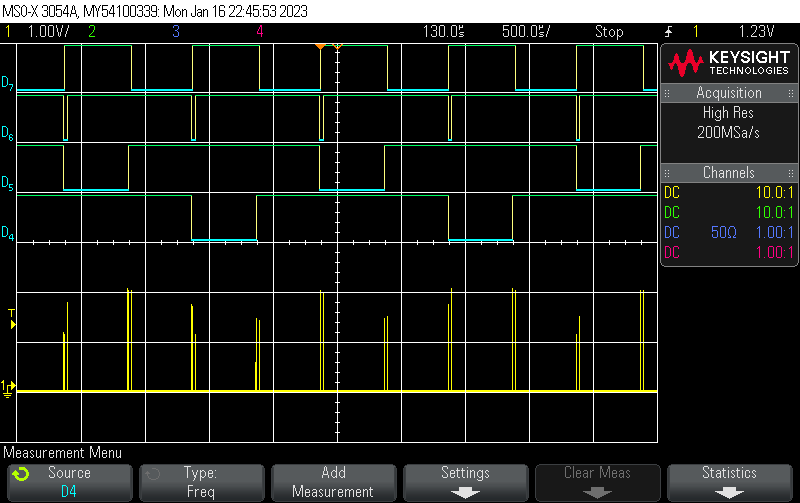

============
Measurements
============

Validation of gate driver signal driving inputs on the GateCon4 circuit.

        Test of gatedrive output with 100Kohm pull up resistores

Notation:

- Ch1: Sync signal
- D4: Sync A
- D5: Sync B
- D6: Sync K
- D7: Dynamic damper

Gate driver signals are inverted, so logical '0' is active and HiZ is inactive.