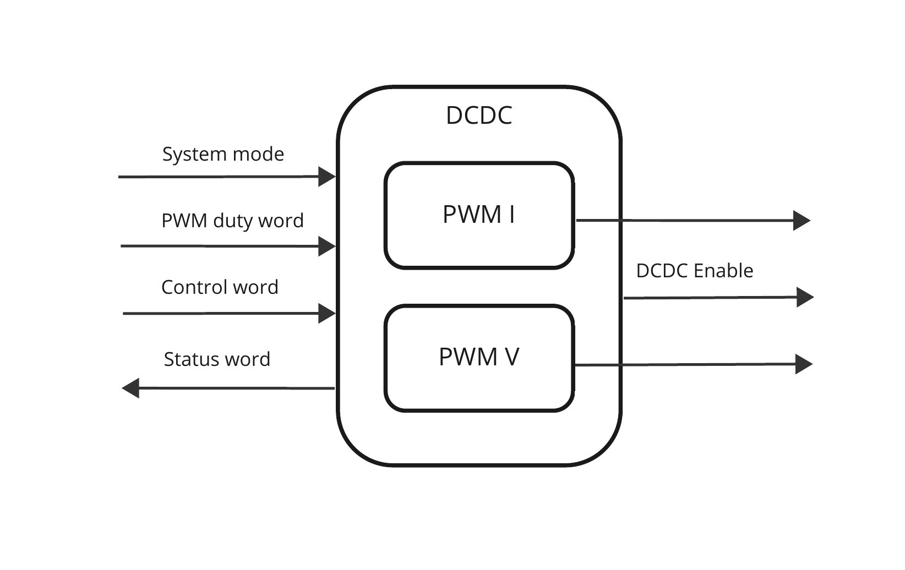

------------
DC-DC module
------------

Functional description
----------------------

The DC-DC module implements the control of the voltage and current pwm signals and enable signal for the physical DC-DC module. It defines the startup behavior of the PWM signals from  default idle setting to required set-point regulation.
The DC-DC module controls two PWM generators for the physical DC-DC module, a set-point for current and a set-point for voltage. The PWM set-points are controllable by the user by loading PWM values into a register, and then starting the PWM generators. The user loadable PWM values are divided into a value-pair. An idle value and a run value. The idle value is a minimum setting for the DC-DC module, that is used when no power is transferred onto the loop. When the power is transferred onto the loop, the run mode setting of the PWM values will be used for each PWM module.

  
   DCDC module implementation

I/O description
---------------

============ === ============
Name         I/O Type
============ === ============
clk          In  Logic
rst_n        In  Logic
curr_control In  Logic [31:0]
volt_control In  Logic [31:0]
mode         In  Logic
pwm_out_curr Out Logic
pwm_out_volt Out Logic
ena_psu      Out Logic
============ === ============

- clk: 
- rst_n: active low reset signal
- curr_control: 
- volt_control: 
- mode: 
- pwm_out_curr: 
- pwm_out_volt: 
- ena_psu: 

.. wavedrom:: ../wavedrom/pwm_control.json
  :caption: Control reg

All four pwm values are the duty cycle in percent ranging from 0% to 100%. The register can be set at any time during operation, and the values will be loaded into the pwm at runtime when the current pwm duty cycle is restarted.

.. wavedrom:: ../wavedrom/pwm_value.json
  :caption: PWM value reg

==== ==========
Name Definition
==== ==========
000  N/A
001  Enable
010  Stop
011  Reset
100  N/A
101  N/A
110  N/A
111  N/A
==== ==========

- run_duty: run pwm duty cycle
- idle_duty: idle pwm duty cycle
- en: Enable signal for the PWM

Timing diagram
--------------
